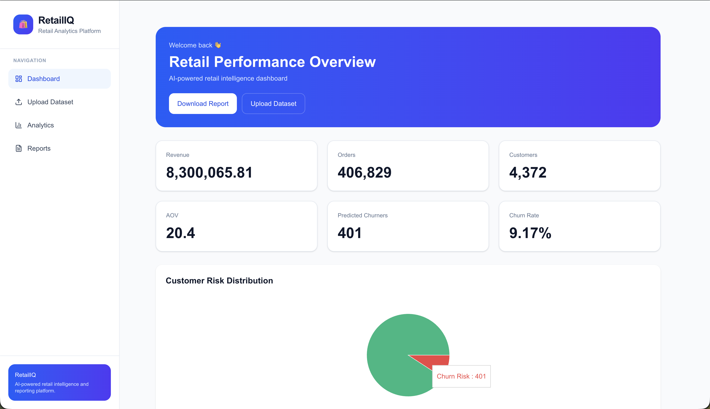
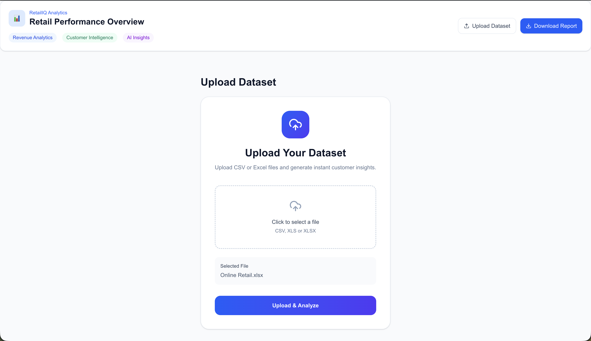
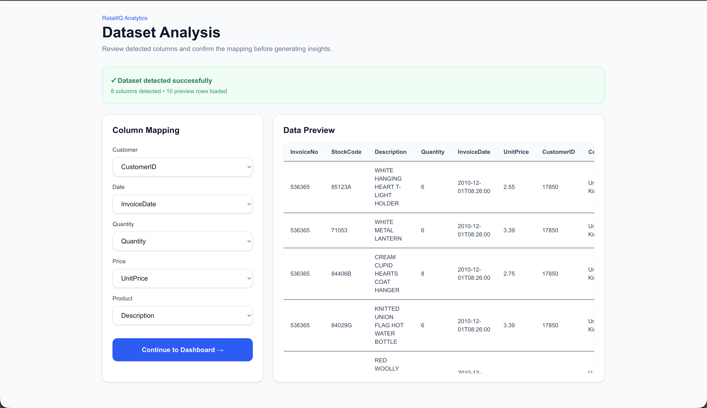
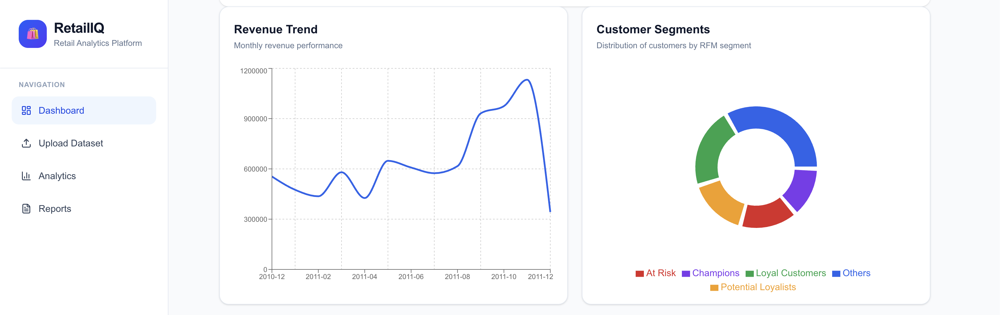
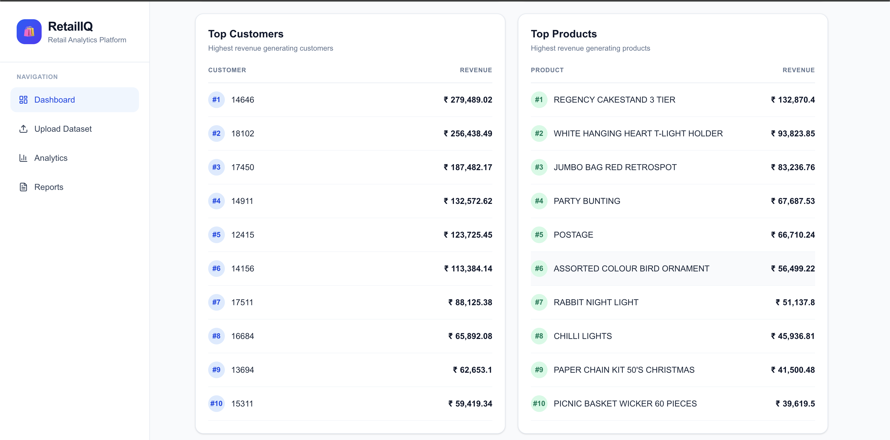
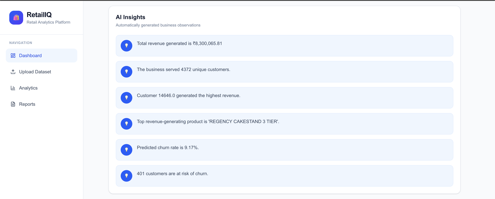
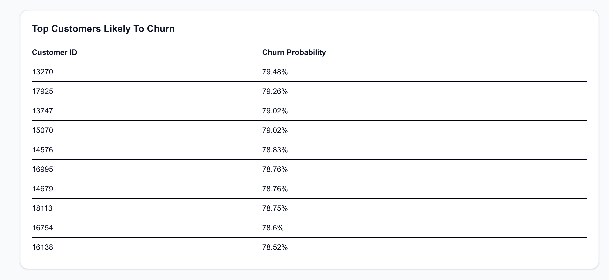
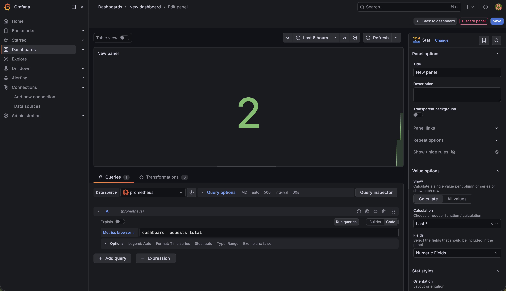
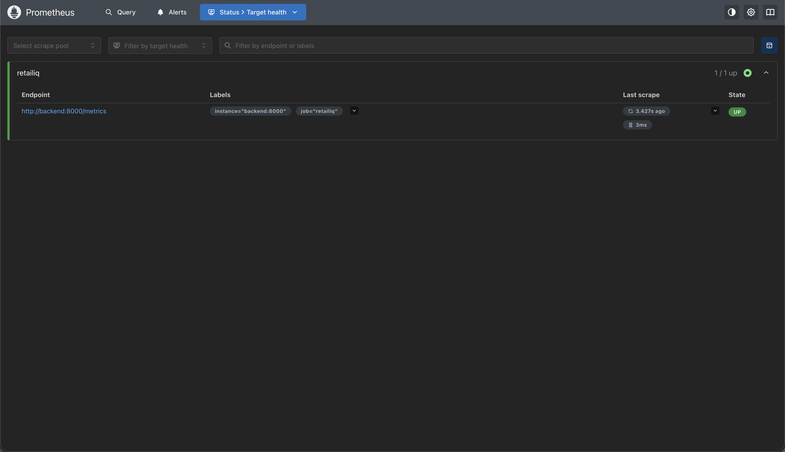

# RetailIQ – AI-Powered Customer Intelligence Platform

RetailIQ is a full-stack analytics platform that transforms raw retail transaction data into actionable business intelligence. It provides customer segmentation, churn prediction, revenue analytics, PDF reporting, monitoring, caching, and cloud-native deployment capabilities.

---

## Key Features

### Analytics & Business Intelligence

* KPI Dashboard (Revenue, Orders, Customers, AOV)
* Revenue Trend Analysis
* Top Customers & Products Analysis
* AI-Generated Business Insights
* Interactive Data Visualization

### Customer Intelligence

* Automated RFM Segmentation
* Customer Churn Prediction using Logistic Regression
* High-Risk Customer Identification
* Customer Risk Distribution Analysis

### Data Processing

* Dataset Upload & Validation
* Dynamic Column Mapping
* CSV & Excel Support
* Automated Data Standardization

### Reporting

* Executive PDF Report Generation
* KPI Summary
* Revenue Trend Charts
* Top Customers & Products
* Churn Risk Analysis

### DevOps & Scalability

* Redis Caching
* Docker Containerization
* Kubernetes Deployment
* GitHub Actions CI/CD
* Prometheus Monitoring
* Grafana Dashboards

---

## Architecture

```text
                 +------------------+
                 |     Grafana      |
                 +--------+---------+
                          |
                 +--------v---------+
                 |   Prometheus     |
                 +--------+---------+
                          |
                          v

+------------+    +--------------+    +------------+
|  Next.js   | -> |   FastAPI    | -> |   Redis    |
+------------+    +------+-------+    +------------+
                         |
                         v
                  +-------------+
                  | PostgreSQL  |
                  +-------------+

Docker • Kubernetes • GitHub Actions
```

---

## Tech Stack

### Frontend

* Next.js
* React
* TypeScript
* Tailwind CSS

### Backend

* FastAPI
* Pandas
* Scikit-Learn
* SQLAlchemy

### Database & Cache

* PostgreSQL
* Redis

### Machine Learning

* Logistic Regression
* Customer Churn Prediction
* RFM Analysis

### DevOps

* Docker
* Kubernetes
* GitHub Actions
* Prometheus
* Grafana

---

## Screenshots

### Dashboard Overview



### Dataset Upload



### Column Mapping



### Revenue Analytics



### Customer & Product Analytics



### AI Business Insights



### Customer Churn Prediction



### Grafana Monitoring



### Prometheus Metrics



---

## Local Development

### Clone Repository

```bash
git clone https://github.com/tirthankar27/RetailIQ.git
cd RetailIQ
```

### Run with Docker

```bash
docker compose up --build
```

Application URLs:

```text
Frontend   : http://localhost:3000
Backend    : http://localhost:8000
Prometheus : http://localhost:9090
Grafana    : http://localhost:3001
```

---

## Kubernetes Deployment

```bash
kubectl apply -f k8s/
```

Verify resources:

```bash
kubectl get pods
kubectl get services
```

---

## Monitoring

### Prometheus

Collects:

* API Request Count
* Request Latency
* Dashboard Requests
* Report Downloads
* Dataset Uploads

### Grafana

Visualizes:

* API Traffic
* Usage Metrics
* Business KPIs
* Application Health

---

## Machine Learning Pipeline

1. Upload retail transaction dataset
2. Generate RFM metrics
3. Engineer customer features
4. Run Logistic Regression model
5. Predict churn probability
6. Identify high-risk customers
7. Display insights through dashboard and reports

---

## CI/CD

GitHub Actions automatically:

* Installs dependencies
* Runs backend checks
* Builds application
* Validates deployment workflow

---

## Author

**Tirthankar Ghosh**

---

## License

This project is intended for educational and portfolio purposes.
