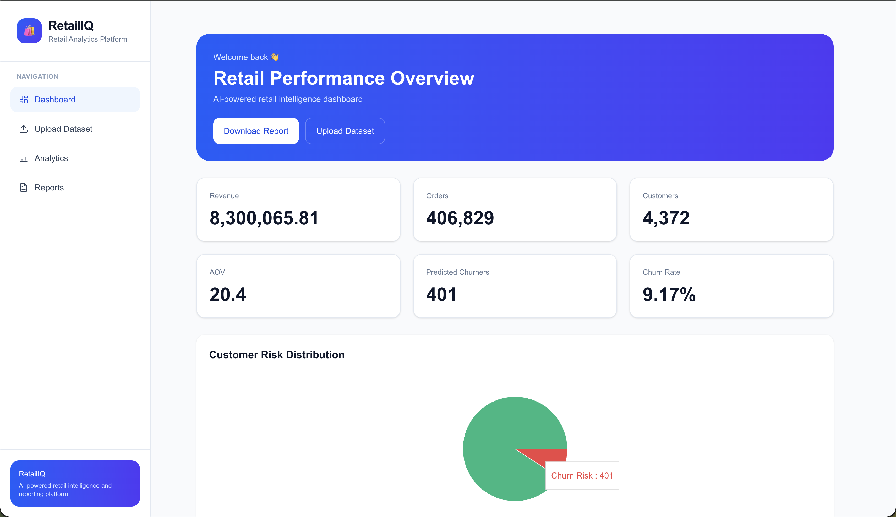
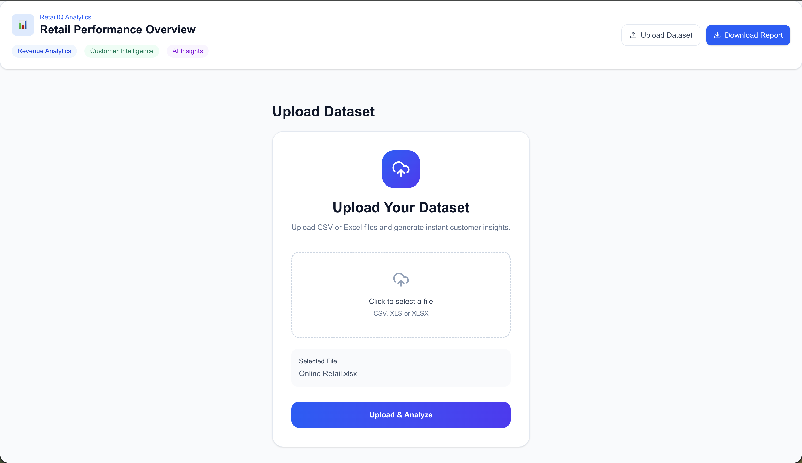
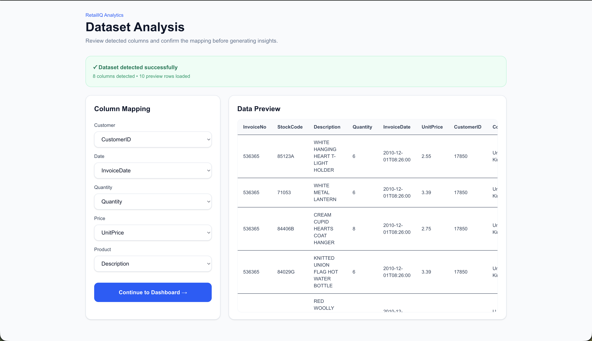
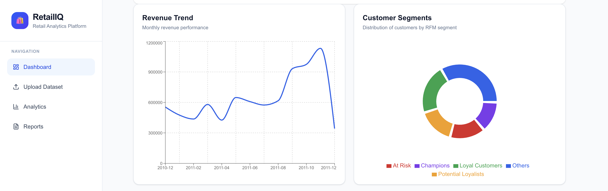
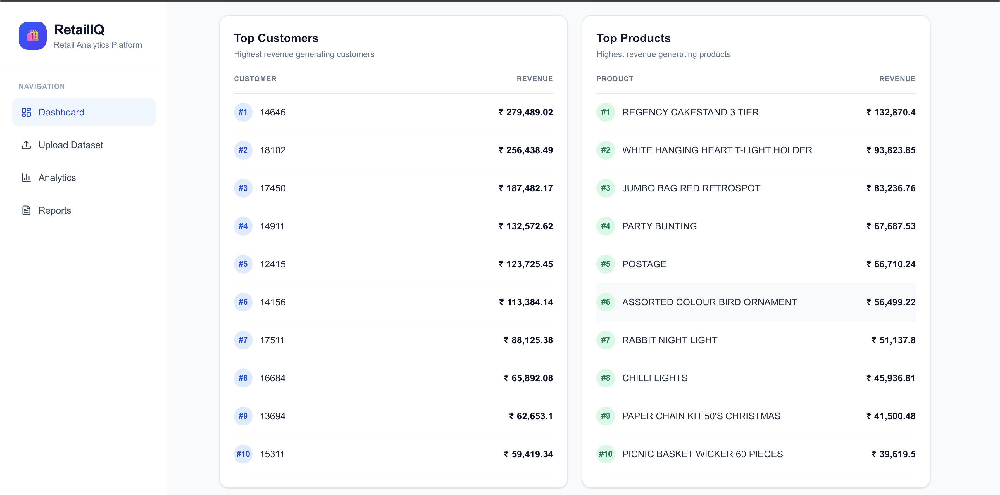
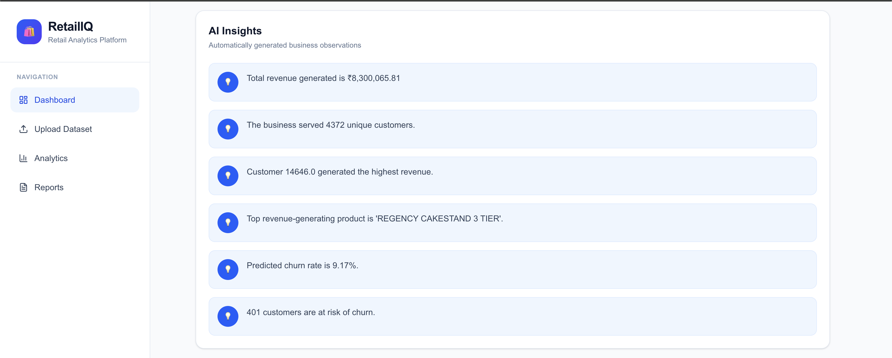
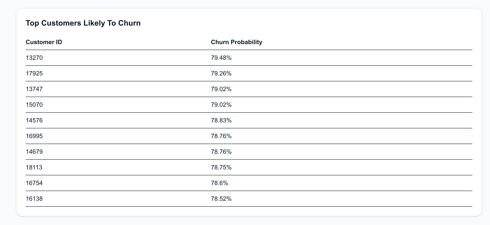
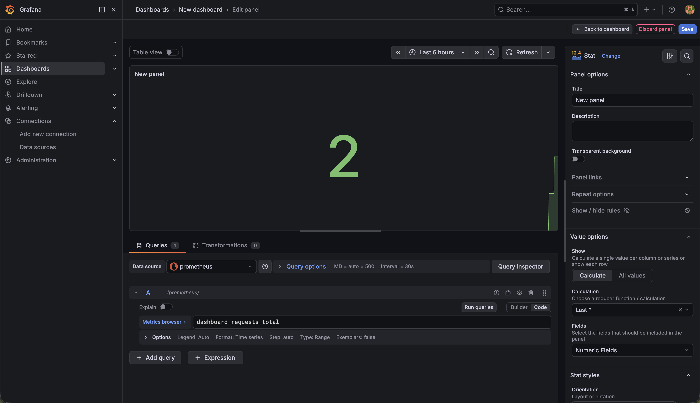
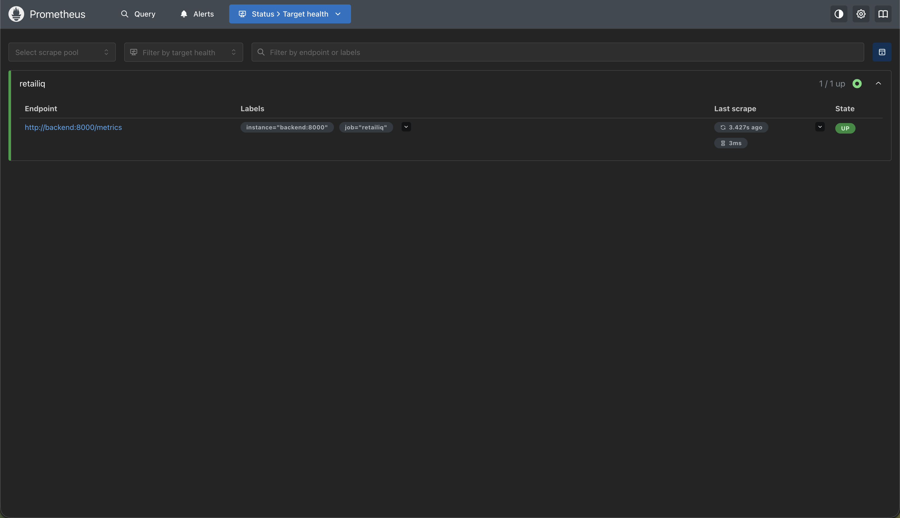

# RetailIQ – AI-Powered Customer Intelligence Platform

RetailIQ is a cloud-native retail analytics platform that transforms raw retail transaction data into actionable business intelligence. It combines customer analytics, machine learning, cloud-native deployment, infrastructure automation, monitoring, and reporting into a single end-to-end application.

---

# Features

## Business Analytics

- KPI Dashboard (Revenue, Orders, Customers, AOV)
- Revenue Trend Analysis
- Top Customers & Products
- Interactive Data Visualizations
- AI-Generated Business Insights

## Customer Intelligence

- RFM Customer Segmentation
- Logistic Regression Churn Prediction
- Churn Probability & Risk Scoring
- High-Risk Customer Identification

## Data Processing

- CSV & Excel Upload
- Dynamic Column Mapping
- Automated Data Validation
- Data Standardization Pipeline

## Reporting

- Executive PDF Report
- Revenue Trend Charts
- KPI Summary
- Customer & Product Analytics
- Top 10 At-Risk Customers
- Churn Analysis

## DevOps & Infrastructure

- Docker Containerization
- Kubernetes Orchestration
- Terraform Infrastructure Provisioning
- Ansible Deployment Automation
- Jenkins Continuous Integration
- Redis Caching
- Prometheus Monitoring
- Grafana Dashboards

---

# Architecture

```text
                            GitHub
                              │
                              ▼
                    Jenkins Pipeline (CI/CD)
                              │
                              ▼
                    Source Code Checkout
                              │
                              ▼
                     Build Verification
            (Python, Node.js, ESLint, Next.js Build)
                              │
                              ▼
                    Ansible Deployment
                              │
         ┌────────────────────┴───────────────────┐
         ▼                                        ▼
   Docker Image Build                  Kubernetes Deployment
         │                                        │
         └────────────────────┬───────────────────┘
                              ▼
                      Azure VM (K3s Cluster)
                              │
      ┌──────────────┬─────────┴─────────┬──────────────┐
      ▼              ▼                   ▼              ▼
   Next.js       FastAPI            PostgreSQL        Redis
                              │
                              ▼
                       Prometheus Metrics
                              │
                              ▼
                       Grafana Dashboards
```

---

# Technology Stack

## Frontend

- Next.js
- React
- TypeScript
- Tailwind CSS

## Backend

- FastAPI
- SQLAlchemy
- Pandas
- Scikit-learn

## Database

- PostgreSQL
- Redis

## Machine Learning

- Logistic Regression
- RFM Analysis
- Feature Engineering
- Churn Prediction

## DevOps

- Docker
- Kubernetes
- Terraform
- Ansible
- Jenkins
- Prometheus
- Grafana

---

# Screenshots

## Dashboard Overview



## Dataset Upload



## Column Mapping



## Revenue Analytics



## Customer & Product Analytics



## AI Business Insights



## Customer Churn Prediction



## Grafana Monitoring



## Prometheus Metrics



---

# CI/CD Pipeline

RetailIQ implements an automated CI/CD pipeline using Jenkins and Ansible.

## Continuous Integration

Every build performs:

- Source code checkout
- Environment verification
- Python validation
- Backend syntax checks
- Frontend dependency installation
- ESLint validation
- Production build verification

## Continuous Deployment

After successful validation, Jenkins automatically triggers Ansible to:

- Build Docker images
- Import images into the K3s container runtime
- Apply Kubernetes manifests
- Perform rolling updates
- Verify deployment rollout
- Perform application health checks

This provides a fully automated build-and-deploy workflow.

# Deployment Workflow

```text
Developer
    │
    ▼
Git Push
    │
    ▼
GitHub Repository
    │
    ▼
Jenkins Pipeline
    │
    ├── Checkout
    ├── Verify Environment
    ├── Backend Validation
    ├── Frontend Build
    └── Deploy
            │
            ▼
      Ansible Playbook
            │
            ├── Build Docker Images
            ├── Load Images into K3s
            ├── Apply Kubernetes Manifests
            ├── Restart Deployments
            ├── Wait for Rollouts
            └── Verify Cluster Health
            │
            ▼
     Azure VM (K3s Cluster)
```

---

# Deployment & Setup

Clone the repository:

```bash
git clone https://github.com/tirthankar27/RetailIQ.git
cd RetailIQ
```

Provision infrastructure:

```bash
cd terraform

terraform init
terraform apply
```

Deploy the complete application:

```bash
cd ../ansible

ansible-playbook -i inventory.ini playbook.yml
```

Run the Jenkins server:

## Jenkins

Jenkins is configured to execute the CI/CD pipeline using the project's `Jenkinsfile`.

After configuring Jenkins with the repository and credentials:

```text
Build Now
```

automatically executes the entire pipeline.

Open Jenkins:

```text
http://localhost:8080
```

Application URLs:

```text
Frontend      : http://<VM-IP>
Backend API   : http://<VM-IP>/api
Prometheus    : http://<VM-IP>:9090
Grafana       : http://<VM-IP>:3001
Jenkins       : http://<VM-IP>:8080
```

---

# Monitoring

Prometheus collects:

- API Request Count
- Request Latency
- Dashboard Requests
- Report Downloads
- Dataset Uploads

Grafana visualizes:

- Request Traffic
- API Performance
- Business KPIs
- Application Health

---

# Machine Learning Pipeline

1. Upload retail transaction dataset
2. Standardize dataset
3. Generate RFM metrics
4. Engineer customer features
5. Train Logistic Regression model
6. Predict churn probability
7. Rank high-risk customers
8. Display insights in dashboard and PDF reports

---

# Project Highlights

- 12+ FastAPI REST APIs
- End-to-End CI/CD Pipeline with Jenkins & Ansible
- Azure Cloud Deployment using K3s Kubernetes
- Dockerized Microservices Architecture
- Infrastructure as Code using Terraform
- Automated Kubernetes Rollouts
- Production-style Monitoring with Prometheus & Grafana
- 541K+ Retail Transactions Processed
- 4.3K+ Customers Analyzed
- AI-powered Churn Prediction (70% Accuracy)
- Executive PDF Reporting
- Customer Segmentation using RFM Analysis

---

# Project Structure

```text
RetailIQ
│
├── backend/
├── frontend/
├── ansible/
│   ├── inventory.ini
│   ├── playbook.yml
│   └── roles/
├── terraform/
├── jenkins/
├── k8s/
├── monitoring/
├── docker-compose.yml
├── Jenkinsfile
└── README.md
```

---

# Production Deployment

RetailIQ is deployed on an Azure Virtual Machine using a production-inspired DevOps workflow.

Deployment stack:

- Azure Virtual Machine
- Docker
- K3s Kubernetes
- Jenkins CI/CD
- Ansible Automation
- Terraform Infrastructure as Code
- Prometheus Monitoring
- Grafana Dashboards

The deployment pipeline automatically builds Docker images, deploys Kubernetes resources, verifies rollouts, and performs application health checks.
The CI/CD pipeline validates code quality, builds production Docker images, deploys them to a K3s Kubernetes cluster using Ansible, performs rollout verification, and confirms application health before completing the deployment.
---

# Author

**Tirthankar Ghosh**

B.Tech Computer Science & Engineering  
National Institute of Technology Sikkim

---

# License

This project is intended for educational and portfolio purposes.